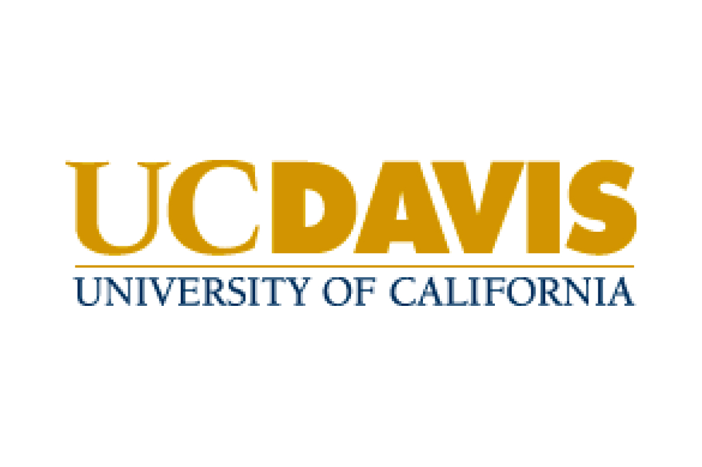

# Hi there. Welcome to my innovative storage! 👋  

**Data-driven Product Manager blending analytics, intuition, and human-centered design.**

I am a data-driven Product Manager focused on building thoughtful, human-centered products grounded in analytics and strong product intuition. I hold a Master’s degree in Commerce & Economic Development (Data Analytics) from Northeastern University, and a Bachelor’s degree from the University of California, Davis. My interests lie in product strategy, data-driven decision making, and designing experiences that connect technology with real human needs.

---
## Education 🎓

  

- **M.S., Northeastern University**, Commerce & Economic Development (Data Analytics), 2023–2025
  

  

- **B.A., University of California, Davis**, Economics (International Macro Finance), 2018–2023 

---

## Featured Project 🧭

### Anchor  

  

A mental wellness product focused on emotional grounding and reflection.  
Designed to help users reconnect with themselves through gentle daily check-ins and thoughtful insights.

**Role:** Product Manager · Product Designer · Engineer · Brand Builder  

Live Demo 🔗: anchor-mood.vercel.app  
Repo 📦: Coming soon...

---

## 🔗 Connect with Me

- 🌐 Personal Website: https://haoyu.vercel.app  
- 💼 LinkedIn: www.linkedin.com/in/chenghaoyu0707
- 📧 Email: haoyucheng267@outlook.com 
- 📄 Resume: Coming soon...

---

> “Where data meets intuition, and products meet people.”
